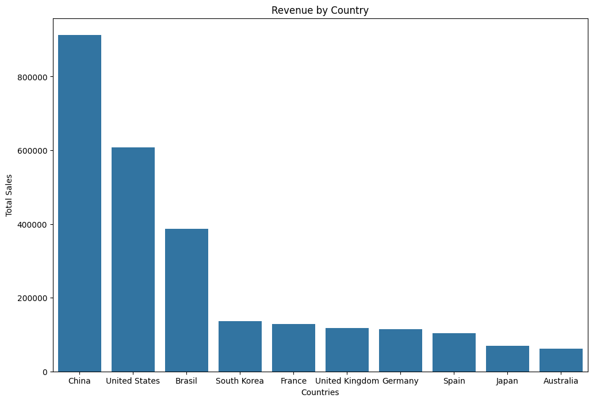
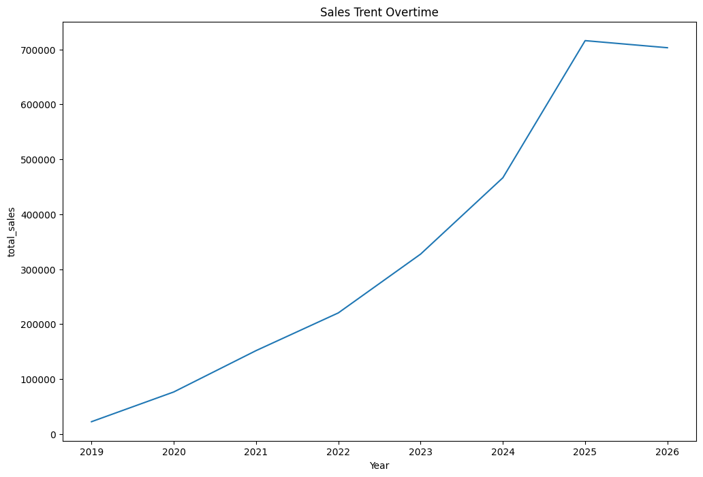
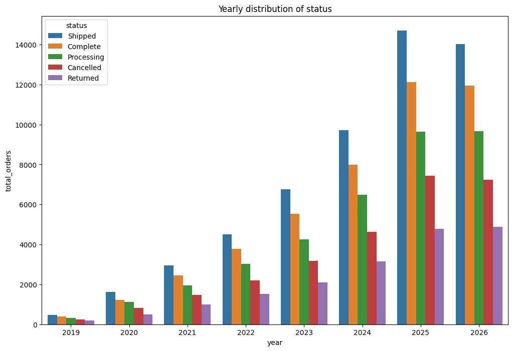

# 🛒 theLook E-Commerce Sales Analysis

## 📌 Project Overview

This project analyzes the theLook eCommerce dataset using SQL, Python, Pandas, and Matplotlib to uncover sales trends, customer purchasing behavior, and business insights.

---

## 📂 Dataset

- Source: Google BigQuery Public Dataset (theLook eCommerce)

---

## 🛠️ Tools Used

- Python
- SQL (BigQuery)
- Pandas
- NumPy
- Matplotlib
- Jupyter Notebook

---

## 📊 Business Questions

- Which countries generated the highest revenue?
- Which year recorded the highest sales?
- Which product categories performed the best?
- What is the cancellation rate?
- Which month generated the highest sales?

---

## 📈 Key Insights

- China contributed the highest share of total sales.
- Revenue increased consistently over the years.
- June recorded the highest sales.
- Cancellation rates remained relatively stable.

---

## 📷 Visualizations

### Sales by Country

### Year-wise Sales

### Distribution Status

---

## 🚀 Future Improvements

- Build an interactive Power BI dashboard.
- Analyze customer segmentation.
- Develop sales forecasting models.

---

## 👨‍💻 Author

**Aavash Upreti**
